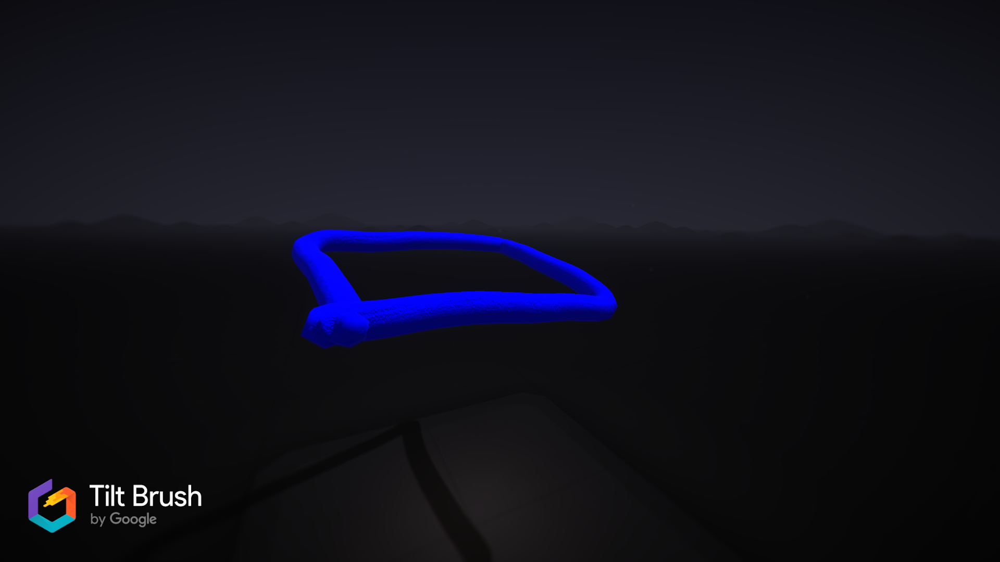

# C# Tilt Brush Tools

Parse, manipulate and write .tilt files within a managed .NET library.

This project was created to complete part of my Master's thesis which looked into the world of Virtual Reality art.  The tools are based off the [Tilt Brush Toolkit](https://github.com/googlevr/tilt-brush-toolkit) project operated by the Tilt Brush team.  

An example of how these tools can be used to generate Tilt Brush files is shown below.


## Important Information

This project has not been endorsed or checked by Google or the TiltBrush team, the information contained is what I can gather from running my project and some of it is most likely incorrect, don't accept my word as gospel.

## Code Example

Quick sample showing how to parse a .tilt file from disk, change the stroke colour and position details and then write the data back to a new file.

### Original Image


```csharp
public static void ExampleAmendExistingCode()
{
	string fileLocation = @"Example.tilt";
	var tiltFile = TiltBrushFile.ParseFromFile(fileLocation);
	string saveLocation = @"Example-Update-Existing.tilt";

	int totalStrokes = tiltFile.SketchInformation.Strokes.Length;

	for (int i = 0; i < totalStrokes; i++)
	{
		Stroke stroke = tiltFile.SketchInformation.Strokes[i];
		//change stroke colour to red - RBGA
		stroke.BrushColor = new float[] { 1, 0, 0, 1 };
		for (int j = 0; j < stroke.ControlPoints.Length; j++)
		{
			//amend the position of the control points in y-direction
			ControlPoint cp = stroke.ControlPoints[j];
			cp.Position[1] += (float)(j * 0.1);
		}
	}
	//we can now write the information back to disk and open the changes in Tilt Brush
	tiltFile.ConvertToTiltFile(saveLocation);
}
```

### Finished Image


---
Another quick sample showing how to create a brand new .tilt file from scratch

```csharp
 public static void ExampleCreateNewCode()
{
	//the project will always look for the provided paths to include the ".tilt" file extension
	string saveLocation = @"Example-Create-New.tilt";
	var file = new TiltBrushFile();
	file.MetadataInformation.Authors = new string[1] { "Prystopia" };
	file.MetadataInformation.EnvironmentPreset = new Guid("ab080599-e465-4a6d-8587-43bf495af68b");
	file.MetadataInformation.AddBrush(Metadata.BrushType.Icing);
	file.SketchInformation.FileName = "New Test";
	//as far as I can tell these are fixed values, however it's worth checking a file from your own installation, just in case they do change.
	file.SketchInformation.HeaderInfo.Sentinal = 3312887245;
	file.SketchInformation.HeaderInfo.Version = 5;
	file.SketchInformation.HeaderInfo.Unused = 0;
	file.SketchInformation.Strokes = new Stroke[1];
	file.SketchInformation.Strokes[0] = new Stroke();
	file.SketchInformation.Strokes[0].BrushIndex = file.MetadataInformation.GetBrushIndex(Metadata.BrushType.Icing);
	file.SketchInformation.Strokes[0].BrushSize = 0.5f;
	file.SketchInformation.Strokes[0].BrushColor = new float[] { 0.4f, 0.3f, 0.8f, 1f };
	//these values define the extension information available in the file
	//both Trigger pressure and Timestamp values will be written to the file against each control point
	file.SketchInformation.Strokes[0].CPMask = Stroke.CPMaskEnum.TriggerPressureAndTimestamp;
	//both flags details and scale information will be written to the file
	file.SketchInformation.Strokes[0].StrokeMask = Stroke.StrokeMaskEnum.FlagsAndScale;
	file.SketchInformation.Strokes[0].Flags = 0;
	file.SketchInformation.Strokes[0].Scale = 0.5f;
	file.SketchInformation.Strokes[0].ControlPoints = new ControlPoint[3];
	file.SketchInformation.Strokes[0].ControlPoints[0] = new ControlPoint();
	file.SketchInformation.Strokes[0].ControlPoints[0].Extension.Timestamp = 62000;
	file.SketchInformation.Strokes[0].ControlPoints[0].Extension.TriggerPressure = 1f;
	//orientation of the right hand controller when the control point was captured
	file.SketchInformation.Strokes[0].ControlPoints[0].Orientation = new float[] { 0.5f, 0.5f, 0.5f, 0.09f };
	//position of the controller tip when the stroke was captured
	file.SketchInformation.Strokes[0].ControlPoints[0].Position = new float[] { 1, 1, 1 };
	file.SketchInformation.Strokes[0].ControlPoints[1] = new ControlPoint();
	file.SketchInformation.Strokes[0].ControlPoints[1].Extension.Timestamp = 62300;
	file.SketchInformation.Strokes[0].ControlPoints[1].Extension.TriggerPressure = 1f;
	file.SketchInformation.Strokes[0].ControlPoints[1].Orientation = new float[] { 0.5f, 0.5f, 0.5f, 0.09f };
	file.SketchInformation.Strokes[0].ControlPoints[1].Position = new float[] { 5, 5, 1 };
	file.SketchInformation.Strokes[0].ControlPoints[2] = new ControlPoint();
	file.SketchInformation.Strokes[0].ControlPoints[2].Extension.Timestamp = 62600;
	file.SketchInformation.Strokes[0].ControlPoints[2].Extension.TriggerPressure = 1f;
	file.SketchInformation.Strokes[0].ControlPoints[2].Orientation = new float[] { 0.5f, 0.5f, 0.5f, 0.09f };
	file.SketchInformation.Strokes[0].ControlPoints[2].Position = new float[] { 10, 10, 1 };
	//we can now write the information to disk
	file.ConvertToTiltFile(saveLocation);
}
```
### Final Image


## Contributing

Currently, there are no plans to extend this project, however this may change in the near future :).  I am always open to contributions and improvements.


